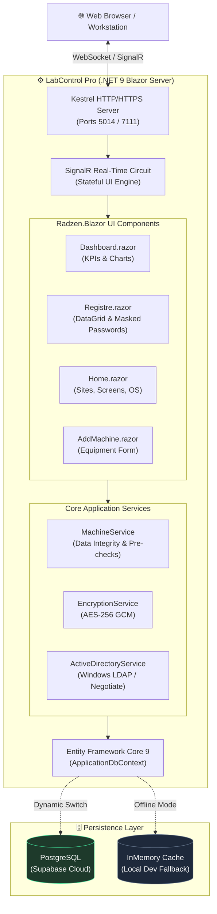

# 🔬 LabControl Pro (*Industrie*)

[](https://dotnet.microsoft.com/)
[](https://dotnet.microsoft.com/apps/aspnet/web-apps/blazor)
[](https://blazor.radzen.com/)
[](https://supabase.com/)
[](https://csrc.nist.gov/)
[](https://www.docker.com/)
[](https://main-nu.vercel.app/)

> **Industrial Equipment Supervision & Pharmaceutical Compliance Platform**  
> Developed for industrial plant environments (Médis / Neapolis) to track manufacturing machines, network topologies, hardware specifications, backup validity, and machine credentials with authenticated **AES-256 GCM** encryption.

---

## 📑 Table of Contents

- [Overview & Purpose](#-overview--purpose)
- [System Architecture](#-system-architecture)
- [Key Features](#-key-features)
- [Quick Start (Local Run)](#-quick-start-local-run)
- [Configuration & Databases](#-configuration--databases)
- [Deployment Options](#-deployment-options)
- [Security & Compliance](#-security--compliance)
- [Project Structure](#-project-structure)
- [Troubleshooting & FAQ](#-troubleshooting--faq)

---

## 🎯 Overview & Purpose

In pharmaceutical and high-precision manufacturing, IT and maintenance teams supervise a diverse fleet of specialized machines (HPLCs, CNC milling stations, packaging robots, automated inspection rigs). **LabControl Pro** centralizes the lifecycle management of these assets:

1. **Real-time Asset Tracking**: Monitoring equipment by site, operating system, and industrial display interface.
2. **Business Continuity (Backup Enforcement)**: Continuous monitoring of daily/weekly backups with visual compliance indicators and automatic alerts for unprotected equipment.
3. **Data Integrity & Traceability (21 CFR Part 11)**: Machine administrative credentials are never stored in plaintext—they are encrypted transparently on write and decrypted on demand using hardware-accelerated **AES-256 GCM**.
4. **Hybrid Identity & Access**: Integrated Windows Active Directory authentication (`Negotiate`/LDAP) with role-based policies (`MEDIS-NABEUL\GMEDIS`) and an offline developer bypass mode for local agility.

---

## 🏛 System Architecture



---

## 🚀 Key Features

| Module | Features & Capabilities |
| :--- | :--- |
| **📊 Real-time Dashboard** | High-visibility KPI cards, pie chart distribution by industrial plant, OS breakdown column charts, and radial backup compliance gauge. |
| **📋 Equipment Register** | Responsive DataGrid with multi-field search and filters (Site, OS, Screen, Backup Status). One-click clipboard copying and masked password reveal with AES-GCM verification. |
| **⚙️ Parameterization** | CRUD management of physical plant sites, display monitors, and operating systems. Foreign key protection prevents accidental cascade deletion of active machines. |
| **📝 Modern Form Workflow** | Multi-fieldset machine configuration with real-time input validation, industrial code badges, and instant backup status toggles. |
| **🔐 Transparent Encryption** | Cryptographically hardened authenticated encryption using AES-256 GCM (12-byte nonce, 16-byte authentication tag). |
| **🎨 Industrial UI/UX** | Fluid entrance transitions (`@keyframes fadeInUp`), live pulsing radar indicators for backup states, angled parallelogram code tags, and smooth hover micro-interactions. |

---

## ⚡ Quick Start (Local Run)

### Prerequisites
- [.NET 9 SDK (LTS)](https://dotnet.microsoft.com/download/dotnet/9.0)
- Any modern web browser (Edge, Chrome, Firefox)

### 1. Clone the Repository
```bash
git clone https://github.com/itshydraaaaaa/main.git
cd main/Industrie
```

### 2. Configure Settings (Optional)
The application works **out of the box** in development mode using a pre-seeded local in-memory store. To connect to Supabase, update your local `appsettings.json` (gitignored for security):

```json
{
  "ConnectionStrings": {
    "DefaultConnection": "Host=aws-0-eu-central-1.pooler.supabase.com;Port=6543;Database=postgres;Username=postgres;Password=YOUR_SUPABASE_PASSWORD;SSL Mode=Require;Trust Server Certificate=true;",
    "Provider": "PostgreSql"
  },
  "Encryption": {
    "Key": "IndustrieLabControl2026SecretKey!"
  }
}
```

### 3. Build & Run
```bash
# Restore and compile
dotnet build

# Launch the application
dotnet run --launch-profile https
```

### 4. Access the Application
Open your browser and navigate to:
- **Plain HTTP (Recommended)**: [http://localhost:5014](http://localhost:5014)
- **HTTPS (Dev Cert)**: [https://localhost:7111](https://localhost:7111)

---

## 🗄 Configuration & Databases

LabControl Pro features a **dynamic database selector** implemented in `Program.cs`:

- **Supabase PostgreSQL (`Npgsql`)**: Automatically activated when a valid connection string is provided. Run `Industrie/supabase_schema.sql` in the Supabase SQL Editor to initialize the schema with `ON DELETE RESTRICT` foreign keys.
- **InMemory Fallback**: Automatically activated when developing locally or offline without database credentials. Seeds 3 sites, 4 OS records, 3 screens, and 3 demo machines.

---

## 🚢 Deployment Options

LabControl Pro supports multiple deployment targets. See the [**Complete Deployment Guide (`DEPLOYMENT.md`)**](DEPLOYMENT.md) for step-by-step instructions.

### 1. Docker Container (Self-hosted / VPS / Cloud)
The repository includes a production-ready, multi-stage `Dockerfile`:
```bash
# Build the container image
docker build -t labcontrol-pro:latest .

# Run the container on port 8080
docker run -d -p 8080:8080 --name labcontrol labcontrol-pro:latest
```

### 2. Cloud Container Hosts (Render, Railway, Fly.io, Azure)
Because Blazor Server requires long-running WebSocket connections, deploy the Dockerfile to platforms supporting stateful containers:
- **Render.com**: Create a **Web Service** connected to this repo with Docker runtime.
- **Railway.app**: Deploy directly using the included `Dockerfile`.
- **Azure App Service**: Deploy as a Linux Web App Container.

### 3. Vercel Showcase Portal
The root repository is configured with `vercel.json` and a modern `index.html` portal:
- Live URL: [https://main-nu.vercel.app/](https://main-nu.vercel.app/)

---

## 🔒 Security & Compliance

- **Authenticated Symmetric Cipher**: Uses `System.Security.Cryptography.AesGcm` (256-bit keys, 96-bit nonces, 128-bit authentication tags).
- **Anti-Circuit Crash Defense**: Decryption validates ciphertext boundaries defensively. Malformed keys return `[Erreur déchiffrement]` badges per row rather than crashing the user's Blazor circuit.
- **LDAP Unmanaged Memory Cleanup**: All Active Directory `PrincipalContext`, `GroupPrincipal`, and search results are wrapped in deterministic `using` and `try-finally` blocks to eliminate unmanaged memory leaks.
- **Cascade Deletion Protection**: Deletion of parent entities (Sites, Screens, OS) is blocked both at the ORM level (`DeleteBehavior.Restrict`) and in the business service layer (`AnyAsync` pre-check).

---

## 📁 Project Structure

```text
industrieproject/
├── Dockerfile                     # Multi-stage production container build
├── .dockerignore                  # Docker build exclusion rules
├── vercel.json                    # Vercel deployment configuration
├── index.html                     # Web portal & architecture showcase
├── README.md                      # Primary project documentation
├── DEPLOYMENT.md                  # Comprehensive cloud & container deployment guide
├── Industrie.sln                  # Visual Studio Solution
└── Industrie/
    ├── Industrie.csproj           # .NET 9 project configuration & dependencies
    ├── Program.cs                 # App bootstrap, auth policies & dynamic DB provider
    ├── supabase_schema.sql        # Supabase PostgreSQL relational DDL
    ├── appsettings.example.json   # Template configuration file
    ├── Components/
    │   ├── App.razor              # HTML document root & script injections
    │   ├── Routes.razor           # Blazor router definition
    │   ├── Layout/
    │   │   ├── MainLayout.razor   # Header with Tunis clock & pharma styling
    │   │   └── NavMenu.razor      # Sidebar navigation menu
    │   └── Pages/
    │       ├── Dashboard.razor    # Analytics, charts, and backup alert tables
    │       ├── Registre.razor     # Full equipment registry DataGrid
    │       ├── AddMachine.razor   # Equipment creation & modification form
    │       └── Home.razor         # Parameterization (Sites, Screens, OS)
    ├── Data/
    │   ├── ApplicationDbContext.cs # EF Core DbContext with AES-GCM ValueConverter
    │   └── DbInitializer.cs       # Database seeding & health diagnostics
    ├── Models/                    # Entity models (Machine, Site, OS, Ecran)
    ├── Services/
    │   ├── MachineService.cs      # Core business logic & integrity checks
    │   ├── EncryptingService.cs   # AES-256 GCM encryption engine
    │   └── ActiveDiractory.cs     # Windows LDAP / Active Directory integration
    └── wwwroot/
        ├── app.css                # Design tokens, animations & shape components
        └── images/Logo.png        # Brand identity logo
```

---

## 📄 License & Attribution

Developed for **Médis / Neapolis Industrielle**. Built with .NET 9, Blazor Server, and Radzen.Blazor.
